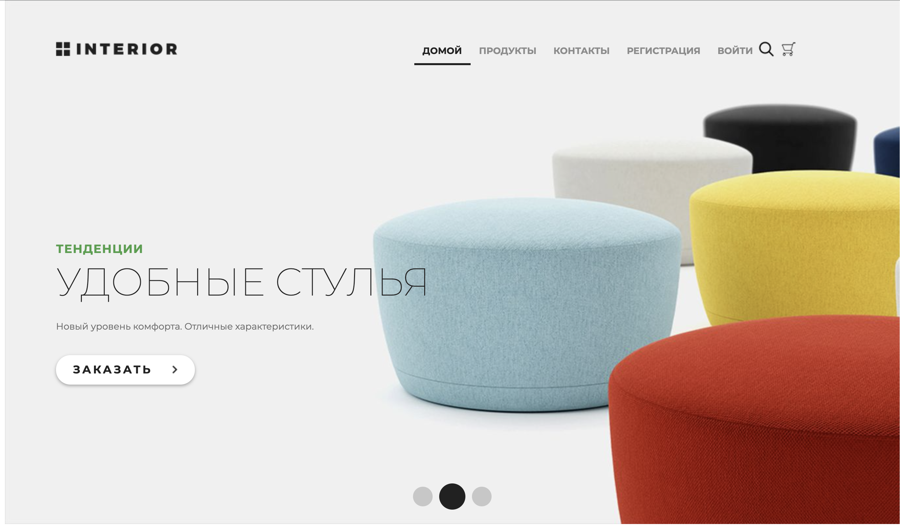

# Проект по курсу обучения base_django_framework
## Интернет магазин GeekShop доступен по адресу http://185.46.10.69/
### Разработка Павел Недошивин aka baster

## relise notes:
### 
### 24/11/2021/ Проект находится в стадии оптимизации и исправления ошибок

___

## Функционал проекта:
1. Реализована регистрация и аутентификация пользователей на сайте (выполнено)
2. Реализована корзина написанная на python + ajax, возможность удаления позиций, изменение количества (выполнено)
3. Реализованная собственная административная панель с CRUD функционалом пользователей, групп и товаром (выполнено)
4. Реализована подетальный вывод информации о товаре и о пользователи с возможностью редактирования (выполнено)
5. Реализована пагинация страниц (выполнено)
6. Реализована авторизация авторизация и регистрация страниц с помощью API VK.COM (выполнено)
7. Реализована активация пользователя посредством отправки токена (выполнено)
8. Реализована форма заказа (выполнено) 
9. 

___

## Окружение проекта:
1. Python 3.10
2. Django 3.2.9
3. python-dotenv 0.19
___

### Склонируйте репозиторий с помощью git

`https://github.com/basterrus/base_django_framework.git`

### Перейти в папку:

`cd geekshop`

### Создать и активировать виртуальное окружение Python.

### Установить зависимости из файла requirements.txt:
`pip install -r requirements.txt`

## Выполнить следующие команды:
### Команда для создания миграций приложения для базы данных
    `python manage.py makemigrations
     python manage.py migrate`
 
### Cоздание суперпользователя:
    `python manage.py create_su`
#### По умолчанию будет создан пользователь:

    `Username (leave blank to use 'admin'): admin
     Email address: admin@domain.com
     Password: admin`
     
### Команда для запуска приложения:
    `python manage.py runserver`
#### Интернет-магазин будет доступен по дефолтному адресу: http://127.0.0.1:8000/
#### Стандартная админ панель Django доступна по адресу  http://127.0.0.1:8000/control/
 

